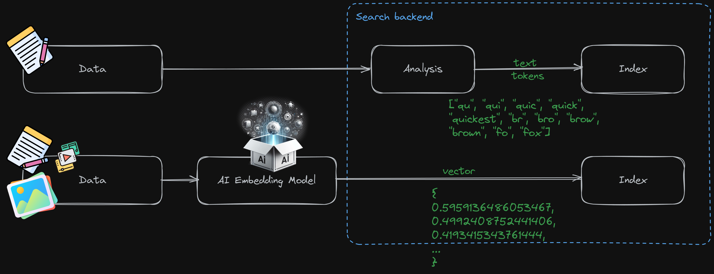
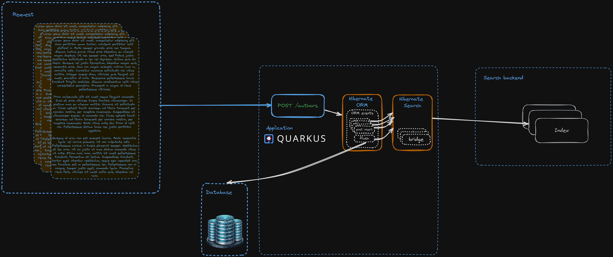
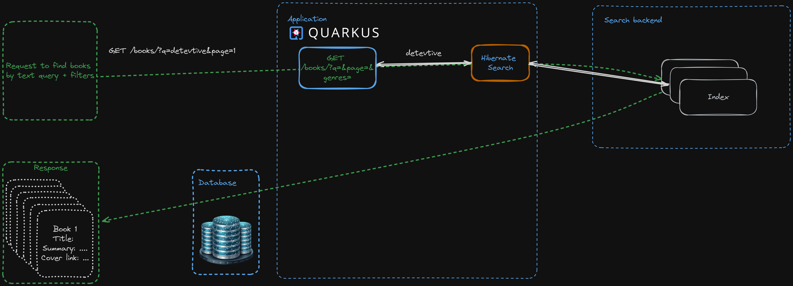
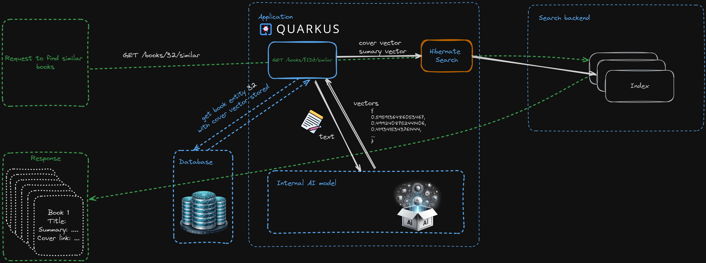

## Difference between regular fulltext search and vector search

- With the regular fulltext search only indexing/searching of text data is possible
  * The way of indexing is defined by the https://www.elastic.co/guide/en/elasticsearch/reference/current/analysis.html[analysis].
  * Analysis happens on the search backend side
- With vector search, besides text, other kinds of data can be searched upon, e.g. images, audio etc. It all depends on what AI model producing vector embeddings you can train/find.
  * Converting data into vectors usually happens outside the search backend context and relies on an AI model.

## Indexing data for a regular fulltext search flow

When using the combination of the Hibernate ORM and Hibernate Search
the user only has to work with the ORM as usual. Hibernate Search
will integrate itself into ORM's events and will monitor the changes and reflect them in the index.

## Searching documents for a regular fulltext search flow

When a search request is made, it is enough to interact just with the Hibernate Search APIs
if https://docs.jboss.org/hibernate/stable/search/reference/en-US/html_single/#mapper-orm-mapping-projection[projections] are used.

## Indexing data for a vector search flow

image::2.1.png[]

In this scenario we have to get the vectors somehow. There are two approaches to it:

- An external AI model service is accessed through e.g. http
and data is converted to vectors by manually calling the service and storing the resulting vector in the entity.
This means that the entity has to have a persisted vector field. This approach is covered by the cover image embedding.
- An AI model is called from the Hibernate Search https://docs.jboss.org/hibernate/stable/search/reference/en-US/html_single/#binding-valuebridge-basics[value bridge]
letting Hibernate Search call the model and create the vector any time it is required.

## Searching documents for a regular fulltext search flow

Searching for similar documents using the https://docs.jboss.org/hibernate/stable/search/reference/en-US/html_single/#search-dsl-predicate-knn[knn predicate]
requires that the "reference" vector is supplied to the predicate.
The vector can either be retrieved from the store, if it was stored there before (cover image),
or can be retrieved by requesting it from the AI model (summary).
